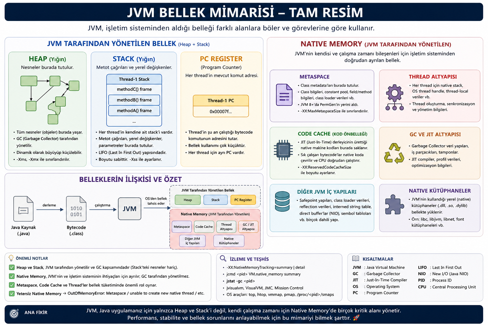
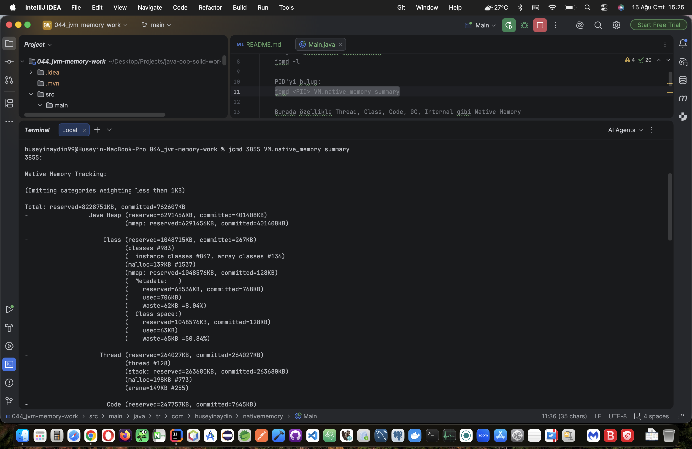
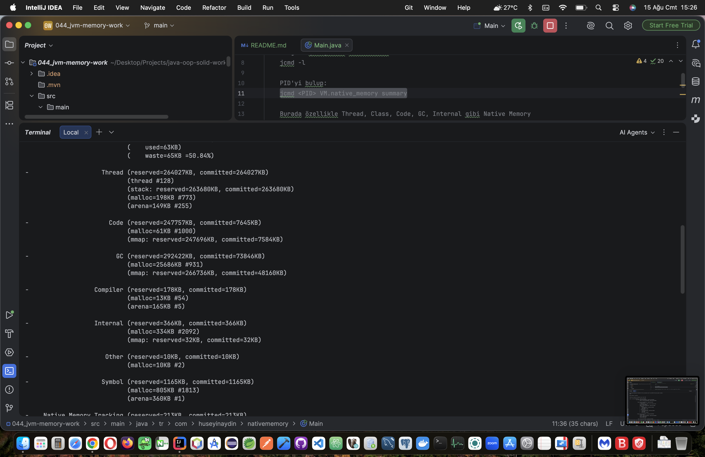
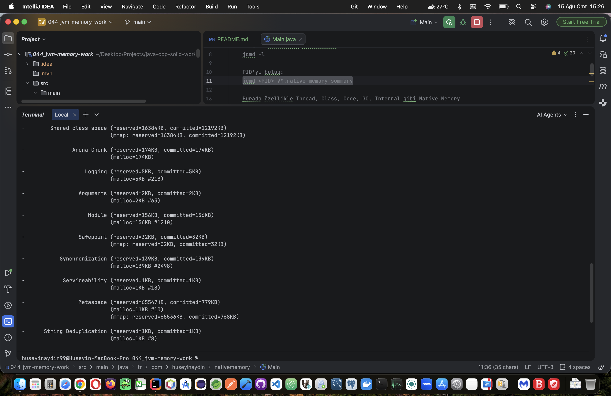

### Java'da Native Memory Nedir?

Native Memory, JVM’nin Java Heap dışında, thread’ler, class metadata, JIT derlenmiş kod ve JVM’nin kendi çalışma altyapısı için işletim sisteminden kullandığı bellektir.

### Heap, Java Stack ve Native Memory Hiyerarşik Olarak Aynı Seviyede Midir?

Native Memory, Heap ve Java Stack dışında kalan ve JVM’nin işletim sisteminden doğrudan aldığı bellek alanlarını kapsar, Native Memory, Heap ve Java Stack alanını içine dahil etmez, Heap veya Stack alanlarıda Native Memory'i içine dahil etmez, bunlar ayrı ayrı olarak JVM tarafından yönetilirler.

### Java'da Metaspace Bellek Alanı Nedir?

Metaspace, JVM’nin sınıflara ait class metadata bilgilerini Heap ve Java Stack dışında ayrı olarak, Native Memory üzerinde tuttuğu bellek alanıdır.

#### Şematize;

```text
JVM Belleği
│
├── Heap
│   └── Java nesneleri
│
├── Stack
│   └── Class veya Primitive tip olarak tanımlanmış değişkenler veyahutta sabitler.
│   └── Thread'lerin çalışma alanı
│
└── Native Memory
    ├── Metaspace → Class metadataları
    ├── Thread → Thread altyapısı
    ├── Code Cache → JIT derlenmiş kodlar(çok çalıştırılan veya performans gerekli durumlar)
    └── GC → Garbage Collector verileri
```

### Native Memory'de Sadece Class Verileri Mi Var? 'interface, record, annotation' verileri yok mu?

interface, record ve annotation gibi yapılar da sınıf metadata’sının parçası olarak Metaspace’te tutulur.

### Java Byte Kodu Diskte '.class' Uzantılı Dosyalar Halinde Tutuluyor. '.class''dan Kasıt Java Programlama da ki 'class' Yani Sınıfları Kast Etmiyoruz Değil Mi? Ayıralım Da Sıkıntı Olmasın!

Evet, burada ayırmak önemli: .class dosyasındaki “class”, Java’daki yalnızca class türünü değil, JVM’nin yüklediği bytecode birimini ifade eder; bunun içinde class, interface, record, enum ve annotation türleri de bulunabilir.

### Metaspace'de class metadata'lar bulunur. Yani byte kod ile alakalı metadata'lar. Öyle mi?

Evet, Metaspace’te JVM’nin yüklediği bytecode birimlerine (class, interface, record, enum, annotation vb.) ait metadata bilgileri bulunur.

### Biz gerekirse bir class'ın instance'sine heap'den o class'ın kendi metadata verisine erişebiliriz. Doğru mu?

Evet; bir instance üzerinden getClass() ile o instance’ın ait olduğu sınıfın Class nesnesine ulaşabilir ve reflection üzerinden metadata bilgilerine erişebiliriz.

### getClass() dan dönen referans heap'den değilde metaspace alanında mı döner? (return eder).

Hayır; getClass() Heap’te bulunan Class nesnesine ait referansı döndürür, bu Class nesnesinin temsil ettiği class metadata ise JVM’nin native memory/Metaspace tarafındadır.

>Yani getClass() → Heap'teki Class nesnesine gider; Class nesnesi → Metaspace'teki metadata'yı temsil eder.
```text
instance
   │
   └── getClass()
          │
          ▼
     Class nesnesi
       (Heap)
          │
          ▼
   Class metadata
     (Metaspace)
```

### Class nesnesi üzerinden mi o Class nesnesine ait metadata'lara erişiyoruz?

Evet; Class nesnesi üzerinden JVM’nin o sınıfa ait Metaspace’teki metadata bilgilerine erişebiliriz.

>Burada clazz Heap'teki Class nesnesine referanstır ve getName(), getDeclaredFields(), getDeclaredMethods() gibi reflection API'leri üzerinden sınıfın metadata'sını görebiliyoruz.
```java
class Person {
    private String name;

    public void sayHello() {
        System.out.println("Selamoaleyko!");
    }
}

public class Main {
    public static void main(String[] args) {

        Person person = new Person();

        Class<?> clazz = person.getClass();

        System.out.println(clazz.getName());
        System.out.println(clazz.getDeclaredFields()[0].getName());
        System.out.println(clazz.getDeclaredMethods()[0].getName());
    }
}
```

### getName(), getDeclaredFields(), getDeclaredMethods() metotları metaspace alanından mı veri veya referans dönüyor? Eninde sonunda oradan mı okuyor?

Hayır; bu metotlar Metaspace’teki metadata’dan bilgi okuyup Java tarafında String, Field, Method gibi Heap nesneleri/referansları döndürür.

### getName(), getDeclaredFields(), getDeclaredMethods() bu metotlar metaspace'deki metadata'ları okuyup heap alanında nesne haline getirip return mü ediyor? Yani doğrudan metaspace alanında return edilmiyorda heap'e getirilip öyle mi dönülüyor?

Evet, kavramsal olarak doğru: JVM metadata’yı Metaspace tarafında tutar; reflection çağrısı bunu Java tarafında kullanılabilir String, Field, Method gibi Heap nesneleri/referansları olarak sunar, yani doğrudan Metaspace’ten bir Java referansı döndürmez.

### JVM’nin iç implementasyonu metadata → Heap nesnesi dönüşümü tam olarak nasıldır?

JVM, Metaspace’teki metadata’yı doğrudan Heap’e kopyalamak yerine, Class/reflection altyapısındaki JVM iç yapıları üzerinden bu metadata’yı yorumlar ve Java tarafında gereken String, Field, Method gibi Heap nesnelerini oluşturup veya mevcutlarını kullanarak döndürür.

>Kurduğumuz model öğrenmek için gayet doğru bir soyutlama; sadece JVM’nin gerçek implementasyonunda bunun arkasında daha karmaşık internal yapılar ve cache mekanizmaları var. Ancak bu tarz yapılar ve mekanizmalar şu an için Java Developer'ları ilgillendirmiyor.

### getName(), getDeclaredFields(), getDeclaredMethods() bu metotlar metaspace'deki metadata'ları okuyup heap alanında jvm'nin iç implementasyonundaki işleyişle, Class/Reflection api ile nesne haline getirip return mü ediyor? Yani doğrudan metaspace alanından return edilmiyorda heap'e dediğim yöntemle getirilip öyle mi dönülüyor?

Metaspace’teki class metadata JVM’nin iç mekanizmaları ve Reflection API aracılığıyla işlenerek Java tarafında String, Field, Method gibi Heap nesneleri/referansları olarak döndürülür; doğrudan Metaspace’ten Java nesnesi return edilmez.

### Thread'lar nerede tutuluyor?

Thread nesnesi Heap’te, thread’in çalışma stack’i ise Stack’te; thread’in JVM/işletim sistemi seviyesindeki native yapıları ise Native Memory’de tutulur.

### Thread’in JVM/işletim sistemi seviyesindeki native yapıları nelerdir?

Bunlar thread’in native stack’i, işletim sistemi thread handle’ı, thread-local/JVM iç kontrol bilgileri ve scheduler gibi mekanizmaların kullandığı native yapılardır.

>Not; şimdilik bunların ayrıntılarını bilmemiz gerekmiyor, Thread → Stack + Native Memory ilişkisini bilmemiz yeterli.

### Thread → Stack + Native Memory ilişkisi nasıldır?

Bir Thread, Java tarafındaki çalışma alanı olarak Stack kullanırken, JVM ve işletim sistemi seviyesindeki thread yapıları için ayrıca Native Memory kullanır.

### Native Memory'deki JIT Code Cache yapısı nedir?

Code Cache, JVM’nin JIT (Just-In-Time) derleyicisinin sık çalıştırılan Java bytecode’larını çalışma sırasında native makine koduna dönüştürüp, CPU’nun doğrudan çalıştırabilmesi için Native Memory’de sakladığı özel bellek alanıdır.

### JIT (Just-In-Time) Compiler Nedir?

>JIT (Just-In-Time) Compiler ⚙️, JVM’nin bytecode’u çalışma anında sık kullanılan sıcak kodları makine koduna çevirerek doğrudan CPU üzerinde daha verimli çalıştırmasını sağlayan mekanizmadır. 🔥 Yani Java kodu baştan tamamen native koda çevrilmez; JVM çalışmayı gözlemleyip hangi kodların gerçekten kritik olduğunu analiz eder, onları optimize eder ve gerektiğinde yeniden derleyerek uygulamanın çalışma performansını artırır. 🚀

### JVM çalışacak olan her bir Java Process'i için işletim sisteminden native memory ayırır. OS'dan talep eder o da ona verir.

Her JVM process’i ihtiyaç duyduğu Native Memory’yi işletim sisteminden talep eder ve işletim sistemi uygun olduğu ölçüde bu belleği JVM process’ine tahsis eder.

---

>Stack ve Heap Native Memory’nin alt parçaları değil, JVM’nin yönettiği ayrı bellek alanlarıdır; Native Memory tarafında ise Metaspace, JIT Code Cache, thread altyapısı, GC/JVM iç yapıları ve native kütüphaneler gibi alanlar bulunur.

### Stack ve Jeap'i JVM yönetmez mi?

Heap ve Java Stack JVM tarafından yönetilir, ancak işletim sistemi bu alanların altında yatan fiziksel/sanal belleği JVM process’ine tahsis eder; yani “JVM yönetir” ile “Native Memory’dir” aynı şey değildir.

Stack ve Heap’i Native Memory’nin “dışında” diye düşünmek öğrenme açısından doğru, ama fiziksel olarak ikisi de JVM process’inin işletim sisteminden aldığı sanal/fiziksel bellek kaynaklarını kullanır; Native Memory dediğimiz şey ise burada Heap ve Java Stack’in dışında kalan JVM'in yönettiği native çalışma alanlarını ifade ediyor.

```text
Java Process
│
├── JVM tarafından yönetilen
│   ├── Heap        → Java nesneleri
│   └── Stack       → Thread'lerin stack'i, primitive veya referans tip değişkenler veyahutta sabitler.
│
└── Native Memory(hem işletim sistemi tarafından ki tahsis eden taraf orası, hemde JVM tarafından yönetilen)
    ├── Metaspace   → Class metadata
    ├── Code Cache  → JIT native kodları
    ├── Thread      → Native thread altyapısı
    ├── GC          → GC'nin native yapıları
    ├── JVM internals
    └── Native libs  → C/C++ vb. yerel kütüphaneler
```

### Native Memory JVM tarafından yönetilmez mi?

Native Memory’nin tahsisi işletim sistemi tarafından yapılır, ancak JVM bu belleğin kendi kullanımını ve ilgili native yapılarını büyük ölçüde yönetir tamamende değil.

### Yani bu konuda işletim sistemide söz sahibidir öyle mi?

Native Memory konusunda hem işletim sistemi belleği tahsis eden taraf olarak hem de JVM bu belleği kendi çalışma ihtiyaçlarına göre yöneten taraf olarak söz sahibidir.



```text
IntelliJ'de VM options kısmına:
-XX:NativeMemoryTracking=summary

Program çalışırken terminalden:
jcmd -l

PID'yi bulup:
jcmd <PID> VM.native_memory summary

Burada özellikle Thread, Class, Code, GC, Internal gibi Native Memory
kategorilerini gözlemleyeceksin; users dizisi ise esas olarak Heap'i büyütecek.
```

### Tracking Görselleri;




